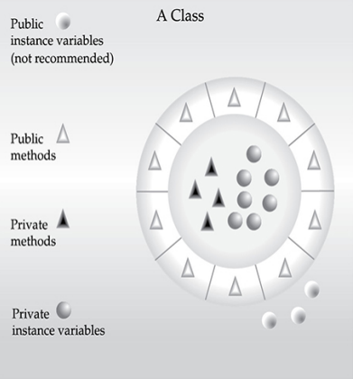
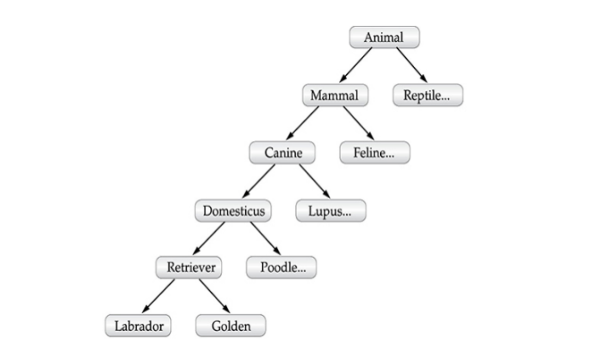
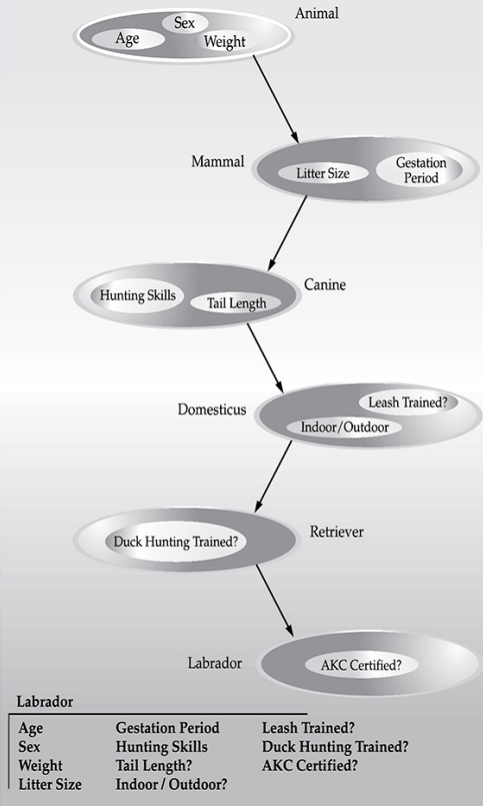

# CHAPTER 2: An Oberview of Java
สรุปฟีเจอร์สำคัญหลายที่จำเป็นของ Java

## Object-Oriented Programming (OOP)
การเขียนโปรแกรมเชิงวัตถุ เป็นหัวใจหลักของภาษาจาวา ควรทำความเข้าใจหลักการนี้ก่อนการเริ่มสร้างโปรแกรมใช้งานจริง

## Two Paradigms
โปรแกรมคอมพิวเตอร์ทุกโปรแกรม จะประกอบไปด้วย 2 องค์ประกอบ คือ

1. ชุดคำสั่ง
2. ข้อมูล

และสามารถถูกจัดโครงสร้างทางความคิดได้ 2 แบบ คือ

1. เกิดอะไรขึ้น (what is heppening)
2. ใครได้รับผลกระทบ (who is being affteted)

โดยทั้ง 2 แนวคิดจะเป็นตคัวกำหนด กระบวนทัศน์ (paradigms) (โปรแกรมถูกสร้างขึ้นมาได้อย่างไร)

โดยในสมัยที่ C ถูกสร้างขึ้น มันใช้แนวคิดแบบ process-oriented (what is heppening)
โดยข้อมูลจะเป็นสิ่งที่ชุดคำสั่งเข้าไปแก้ไข เช่น

    struct Account {
        double balance;
    }

    void deposit(struct Account* acc, double amount) {
        acc->balance += amount;
    }

    void withdraw(struct Account* acc, double amount) {
        acc->balance -= amount;
    }

โดยเมื่อโปรแกรมใหญ่ขึ้น ก็จะพบว่าโค้ดนั้นดูแลรักษายากขึ้น ทำให้เกิดแนวคิด OOP ขึ้นมา โดยมันรทำให้เรารู้ว่า ข้อมูล นั้นที่เรามีรอยู่ สามารถจัดการกับมันได้ยังไงบ้าง

## Abstraction
นามธรรม ในการเขียนโปรแกรมเชิงวัตถุ คือการเลือกแสดงเฉพาะสิ่งที่สำคัญต่อการใช้งาน และซ่อนรายละเอียดที่ไม่จำเป็นต่อการทำงานออกไป เช่น ผู้ใช้รู้ว่าสามารถใช้รถยนต์เคลื่อนที่ไปที่ไหนก็ได้ โดยที่เขาไม่ต้องรู้ว่า เครื่องยนทำงานอย่างไร

## หลักการ 3 ประการในการเขียนโปรแกรมเชิงวัตถุ (The Three OOP Principles)
### การห่อหุ้ม (Encapsulation)
เป็นการที่เราจะเชื่อมต่อกับข้อมูลกับชุดคำสั่งสำหรับประมวลผลข้อมูลนั้น ๆ เข้าด้วยกัน
แต่การเข้าถึงข้อมูลเหล่านั้น จะมีการปกป้องข้อมูลไว้ เพื่อป้องกันไม่ให้ข้อมูลถูกเข้าถึงโดยพลการ

ลองเปรียบเทียบกับกสรขับรถ ข้อมูลที่คุณจำเป็นต้องปรับแต่งระหว่างการขับอาจมี อัตราเร่ง ความลาดชันพื้นผิว ตำแหน่งของเกียร์ และอื่น ๆ แต่วิธีที่เราจะปรับแต่งข้อมูลเหล่านั้น เราสามารถทำได้วิธีเดียว นั่นก็คือ การขยับเกียร์

ในการเขียนโค้ด นักพัฒนาสามารถเข้าถึงข้อมูลได้ โดยไม่จำเป็นต้องรู้รายละเอียดลึก และไม่ต้องกังวลถึงผลกระทบที่ไม่คาดคิด

*คลาส กำหนดโครงสร้างและพฤติกรรม (ข้อมูลและโค้ด) และจะถูกนำไปเป็นต้นแบบให้กับอ็อบเจ็กต์* และด้วยเหตุผลดังกล่าว ทำให้อ็อบเจ็กต์มักจะถูกเรียกว่าอินสแตนซ์ของคลาส

แต่ละเมธอดหรือตัวแปรในคลาส อาจถูกกำหนดให้เป็น public หรือ private

- **public** เป็นการบอกว่า เมธอด หรือ ตัวแปร นี้สามารถเข้าถึงและใช้งานได้จากภายนอก
- **private** เป็นการบอกว่า เมธอด หรือ ตัวแปร นี้สามาราถเข้าถึงและใช้งานได้จากภายในเท่านั้น

### การสืบทอด (Inheritance)
เป็นกระบวนการที่อ็อบเจ็กต์หนึ่ง จะได้รับคุณสมบัติจากอีกอ็อบเจ็กต์

ซึ่งคุณสมบัตินี้ ทำให้การขยายความสามารถของอ็อบเจ็กต์สามารถทำได้ง่ายและรวดเร็ว
เช่น 
    เรามีรถเย็นอยู่ 1 คัน และเราอยากเพิ่มความสามารถให้เพดานของรถสามารถเปิดออกได้ เราไม่จำเป็นต้องสร้างรถขึ้นมาใหม่ แต่เรานำรถคันเดิมมาสืบทอดความสามารถ และเพิ่มความสามารถใหม่เข้าไปได้เลย

### หลายรูปแบบ (Polymorphism)
คือการที่สิ่งเดียวกัน สามารถแสดงพฤติกรรมที่แตกต่างกันได้ ขึ้นอยู่กับว่ามันเป็นชนิดอะไรจริง ๆ 

<mark>เรียกเหมือนกัน แต่ทำงานต่างกัน</mark>

ตัวอย่างในชีวิตจริง **ปุ่ม play**
- ในเครื่องเล่นเพลง = เล่นเพลง
- ในยูทูป = เล่นคลิป
- ในเกม = เล่นเกม

จากข้อมูลข้างต้น ทุกอันจะใช้ปุ่ม play เดียวกัน แต่**พฤติกรรมแตกต่างกัน** นี่คือ Polymorphism

โดยใน oop คือ การอ้างอิงอ็อบเจ็กผ่าน **ชนิดแม่** (interface / super class) แต่พฤติกรรมจริงขึ้นกับ **ชนิดลูก**

*Polymorphism เป็นภาษากรีก แปลว่า หลายรูปแบบ*

### การทำงานร่วมกันของทั้ง 3 หลักการ (Polymorphism, Encapsulation, and Inheritance Work Together)
เมื่อเรานำหลักการทั้ง 3 มาใช้ร่วมกัน จะทำให้เราได้รับโปรแกรมที่มีความแข็งแกร่ง ปรับขนาดได้ บำรุงรักษาง่าย และโค้ดสะอาดตา

## A First Simple Program
ตัวอย่างโปรแกรมจาวา

    /*
        This is a simple Java program
        Call this file "Example.java"
    */
    class Example {
        public static void main(String[] args) {
            System.out.println("This is a simple Java program");
        }
    }

## เข้าสู่โปรแกรม (Entering the Program)
ในภาษาโปรแกรมอื่นการตั้งชื่อไฟล์อาจไม่สำคัญ แต่สำหรับจาวานั้นสำคัญมาก 

ในจาวาไฟล์ที่เก็บชุดคำสั่ง จะถูกเรียกอย่างเป็นทางการว่า **หน่วยการคอมไพล์** (compilation unit) ซึ่งเป็นไฟล์ข้อความที่จัดเก็บ **นิยทของคลาสหนึ่งหรือมากกว่า** 

*ไฟล์หน่วยการคอมไพล์ จะลงท้ายด้วย .java*

## Compiling the Program
เราสามารถคอมไพล์ชุดคำสั่งของเราได้ ด้วยการใช้คำสั่ง javac [ชื่อไฟล์.java] เช่น

    javac Example.java

เพื่อคอมไพล์เสร็จ จะได้ไฟล์ .class ซึ่งจัดเก็บ java byte code ของโปรแกรม และเราสามารถเรียกใช้งานชุดคำสั่ง byte code ของเราได้ผ่าน java [ชื่อไฟล์] เช่น

    java Example

## รายละเอียดของโปรแกรมแรกของเรา (A Closer Look at the First Sample Program)

    /*
        This is a simple Java program
        Call this file "Example.java"
    */

สิ่งที่เราเห็นอยู่เรียกว่าคอมเมนท์ (comment) ใช้สำหรับให้ผู้เขียน สามารถอธิบายชุดคำสั่งต่าง ๆ ได้ โดยข้อความที่อยู่ในคอมเมนท์จะถูกละเลยจากคอมไพเลอร์

โดยในจาวา จะลองรับคอมเมนท์ทั้งหมด 2 รูปแบบ คือ
1. // แบบบรรทัดเดียว
2. /* แบบหลายบรรทัด */

    class Example {

บรรทัดนี้ใช้คีย์เวิร์ด 'class' เพื่อประกาศว่ากำลังกำหนดคลาสใหม่ โดยคลาสนี้มีชื่อว่า example

    { }

สิ่งนี้ใช้สำหรับกำหนดขอบเขตของคลาส สมาชิกของคลาสจะต้องอยู่ภายในปีกกา เปิด-ปิด นี้เท่านั้น

    public static void main(String[] args) {

บรรทัดนี้คือเมธอด main ซึ่งในภาษาจาวา นี่จะเป็นเมธอดแรกของระบบที่จะถูกเรียกใช้งาน
- public เป็นการทำให้ชุดคำสั่งภายนอก สามารถเรียกใช้เมธอด main ได้ (JVM ต้องเรียกใช้ก่อนการสร้างอ็อบเจ็กต์ใด ๆ)
- void เป็นการบอกคอมไพเลอร์ว่าเมธอดนี้จะไม่ส่งค่าอะไรกลับไป

ค่าใด ๆ ก็ตามที่เราต้องการส่งให้กับเมธอด เราจะใส่ไว้ในวงเล็บเปิดปิดหลังชื่อเมธอด สิ่งนี้เรียกว่าพารามิเตอร์ (parameters) โดยจากตัวอย่าง 

    main(String[] args)

เมธอด main จะรับข้อมูลจาก command line

    System.out.println("This is a simple Java program.");

เป็นการแสดงข้อความ 'This is a simple Java program' ออกไปที่ command line และทำการขึ้นบรรทัดใหม่

*System เป็นคลาสที่ถูกกำหนดไว้ล่วงหน้าสำหรับจัดการกับ input, output*

## Two Control Statements